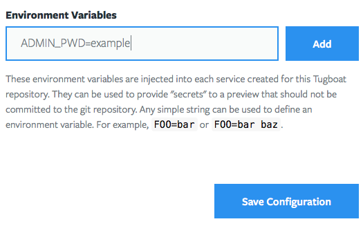

# Tugboat Template for Backdrop

This is a [configuration file](https://github.com/TugboatQA/Backdrop-CMS/blob/master/.tugboat/config.yml) for spinning up a new [Backdrop site](https://backdropcms.org) in Tugboat. It uses Drush to download the latest version of Backdrop and spin up a clean LAMP stack. 

Tugboat is free to use. It comes in handy to automatically build out a fully working version of the site for every pull request, branch or tag. The full tutorial will soon be [over here](https://tugboat.qa/). 

## Installation

1. Fork this repository and create a new project in [Tugboat](https://dashboard2.tugboat.qa/).
2. You'll need to create a custom environment variable in Tugboat to set the admin password. Once your forked repository is created, navigate to the Repository Settings page in Tugboat and add the following environment variable:

    

    - ADMIN_PWD="Choose a password for the initial user"

    Whenever Tugboat spins up a preview, these credentials will give you access to the Backdrop admin area. 
    
That's it. For more information check out the [Tugboat documentation](https://docs.tugboat.qa) to see what else you can do. If you have any questions, [hit us up in Slack](https://launchpass.com/tugboatqa). May the wind always be at your back. --Matt

